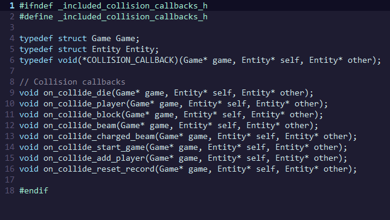

# Visão geral

Minha abordagem principal ao desenvolver o jogo foi aprender um padrão de projeto muito utilizado em game development: Entity-Component-System (ECS).
Esse padrão não é necessário para se desenvolver um jogo simples como nossa versão do R-Type.
Mas sempre tive curiosidade de ver como ele funciona na prática, então resolvi implementar uma adaptação* dele nesse trabalho.

Em aspectos de *design*, o jogo é ainda pouco aproveitado, já que não existe um senso de progresso durante o jogo, a não ser pela pontuação que cresce com (1) o decorrer de tempo e (2) a destruição de inimigos.
Os inimigos vêm em uma horda aleatorizada e sem fim de *airmines* (inimigos circulares) e *flies* (moscas gigantes).
Além dos blocos que diminuem o espaço disponível da tela para o player.

O menu inicial do jogo possui três opções:

- *iniciar jogo*: acredite se quiser, inicia o jogo
- *adicionar jogador*: cria um segundo jogador controlado com o enter e as setas
- *resetar recorde*: exclui o arquivo de persistência do recorde

*adaptação não muito realista, pois no meu código eu não uso uma implementação *data oriented* e este é um dos maiores benefícios do padrão, mas só descobri isso depois de haver escrito bastante código.

# Código

O código fonte se encontra nas pastas `src` e `include`. E na subpasta `components` de cada um deles.

O arquivo que contém a função main é o `src/rtype.c`.
Ele é responsável pelos aspectos de "baixo nível" como alocar memória para funcionamento do jogo (linha 13), inicializar allegro, atribuir `delta_time` (linhas 123-125) e gerenciar os estados das teclas (linhas 129-134).
Este arquivo inicializa e atribui campos do struct `Game` que está declarado em `include/game.h`.

O arquivo `include/game.h` define um struct `Game` que contém todos os dados do jogo:

Só existe uma instância desse struct no funcionamento do programa (`src/rtype.c:13`).
E essa instância é compartilhada entre todos os procedimentos que definem o funcionamento do jogo, os chamados *systems*.
A implentação dos símbolos desse arquivo (encontrada em `src/game.c`) possui diversos *systems* que não são particulares a um componente específico, isso será mais explicado adiante.
Os dados contidos no struct `Game` são: o estado do jogo, os recursos disponíveis (ficam todos carregados na memória, já que são poucos) e, principalmente, as entidades, que são o coração do código.

Os arquivos *entity* (`src/entity.c` e `include/entity.h`) são uma parte essencial do código fonte.
Uma *entity* ou entidade é a representação de um objeto qualquer dentro do jogo, ela contém informações que dizem se a entidade está morta, a que camada ela pertence e quais componentes ela tem (através de um bitmask).
Entidades inutilizadas devem ser marcadas como mortas para a memória que ela ocupa ser reutilizada, inicializando uma nova entidade que a sobrescreva (isso é feito em `src/entity.c:5-10`).
Entidades são como bolhas vazias que devem ser preenchidas com componentes (*components*) que dão comportamento a uma entidade.
Por exemplo, todas as entidades que aparecem na tela têm uma posição, então possuem um `PositionComponent`, todas que se movem possuem um `VelocityComponent`.

Os *components* são nada mais do que structs que seguram dados e apenas isso: não contém em si mesmos instrução alguma.
Os *systems* é que são responsáveis por comportamento, mas eles agem em uma entidade baseado em seus componentes.
Por exemplo, os componentes `BoxCollComponent` e `CircleCollComponent` não sabem o que é uma colisão, apenas demarcam o perímetro dentro do qual a entidade deve colidir (ver imagem abaixo), apenas o *system_detect_collision* sabe atuar nesses dados para verificar colisões.

Além do perímetro de colisão, esses componentes têm um ponteiro para função chamado `COLLISION_CALLBACK`. Essa função é chamada sempre que o *system* detecta que ele colidiu, a definição do tipo e as implementações são feitas nos arquivos `collision_callbacks.h/.c`:

# Build

Execute `run.bat` para compilar o código
